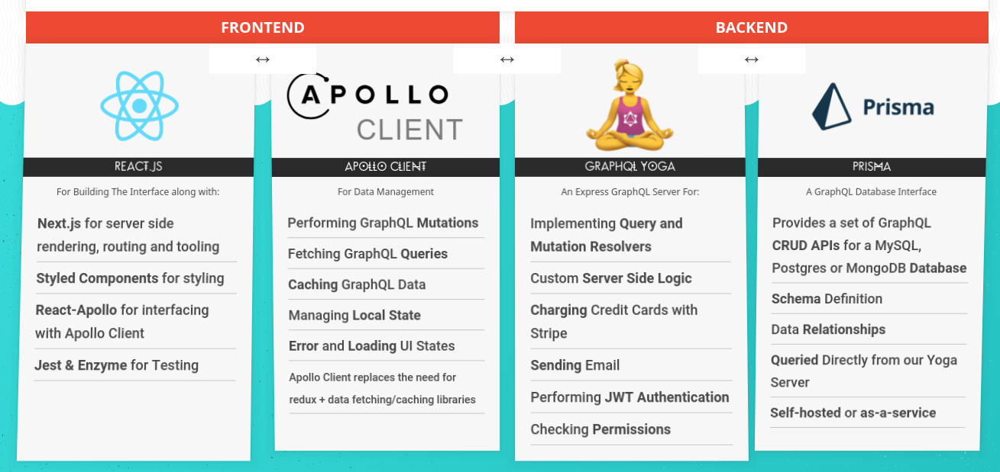
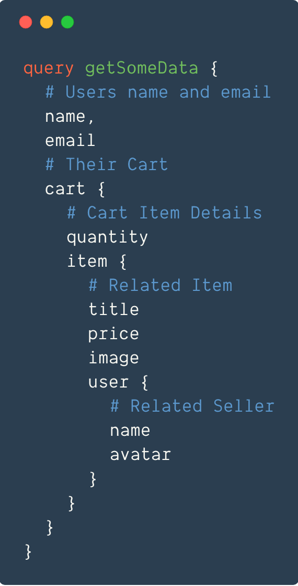

# SaaS Starter

## Project Status

The project has not been updated for a _very_ long time (aside from security
fixes) for the latest in React 16+, Hooks, Apollo 3 and [Prisma
2](https://www.prisma.io/docs/about/prisma/faq#since-prisma-20-is-released-will-prisma-1-still-be-maintained).

## A message from the author

> Maintaining an open source database requires an immense amount of time and
> energy, even more so due to JS growing pains like dependency "hell",
> non-backward compatible dependency upgrade or frequently breaking changes
> introduced by third-party libraries.
>
> Unfortunately I no longer have the time or energy to continue this work.
>
> If you are interested in building better websites or looking for a simple and
> better (maintainable) starter kit, I suggest that you look at the
> [Remix](https://remix.run/) framework which will soon going open source and
> check out Kent Dodds's post, ["How I built a modern website using Remix in
> 2021"](https://kentcdodds.com/blog/how-i-built-a-modern-website-in-2021).
> 
> ~ [@cedric_chee](https://twitter.com/cedric_chee)

demo: _coming soon_

SaaS Starter is an open source full stack software-as-a-service online mart complete with real credit checkout. Users can search, sell, add to cart and checkout their favourite grocery items.

This is a full stack JavaScript application built with [React.js](https://reactjs.org/), [GraphQL](https://graphql.org/), [Node.js](https://nodejs.org) and friends.

## The Tech Stack

## Application Architecture

The following is the design of the frontend and backend of the application.

The application has five main models:
- Users
- Items
- Orders
- CartItems
- OrderItems

all of which are relational and utilizing the power of relational [GraphQL Queries](https://graphql.org/learn/queries/).

The app also includes many server side bits including:
- JWT authentication
- permissions
- sending email
- uploading images
- charging credit cards

## Development

Developer skills required to build an online mart with React, GraphQL and some of today's top JavaScript technology.

### React.js and Modern JavaScript

You should be already familiar with the basics of React - components, state, props, modules and event handlers.

You should be comfortable with both writing and debugging modern JavaScript including arrow functions, classes, promises, async+await and other commonly used parts of [ES6](http://exploringjs.com/es6/).

The backend of the app is written in Node.js. Prior Node.js knowledge is nice, but not required.

The app requires knowledge of GraphQL, [Apollo Client](https://www.apollographql.com/client/), [Prisma](https://www.prisma.io/), databases, or [testing React components](https://airbnb.io/enzyme/docs/guides/jest.html).

### What is GraphQL?

Just as React has transformed the way we build web applications, GraphQL is changing how we build APIs to query and mutate data.

GraphQL is a type-safe query language for APIs and a runtime for fulfilling those queries with your existing data.

What?! It's a replacement for (_or addition to_) your REST API and Ajax Calls.

GraphQL requires buy-in from both your client and your server — it then puts the power of requesting **only what you want** into the client and the business logic of finding and filtering that data into **backend resolvers**.

It enables libraries that make caching, loading, error handling and pagination a breeze.

Complex Relational Data queries and server-side mutations like signing up or checking-out are a snap with GraphQL.

GraphQL is just a standard and can be implemented in any language or framework.

### Concepts

The concepts implemented into our entire full-stack application along with general JavaScript best practices:

- React Best Practices
- [Server Side Rendering](https://nextjs.org/docs/)
- [Styled Components](https://www.styled-components.com/)
- [Theming](https://www.styled-components.com/docs/advanced#theming)
- [React Render Props](https://reactjs.org/docs/render-props.html)
- Routing
- [GraphQL Schema](https://graphql.org/learn/schema/)
- [Queries and Mutations](https://graphql.org/learn/queries/)
- [JSON Web Token (JWT)](https://jwt.io/)
- [Resolvers](https://www.prisma.io/tutorials/build-a-graphql-server-with-prisma-ct02/#implement-the-resolvers-for-your-graphql-server-using-prisma-bindings)
- [Cache Management](https://www.apollographql.com/docs/react/advanced/caching.html)
- [Loading and Error States](https://www.apollographql.com/docs/react/features/error-handling.html)
- Sending Email
- Logic and Flow with Async + Await
- Authentication and Permissions
- [Charging Credit Cards](https://stripe.com/docs/quickstart)
- Hosting and Transforming Images
- Pagination
- Forms in React
- Animations
- Third party React Components
- Unit Testing
- Mocking Components
- Mounting vs Shallow Rendering
- Deployment

## Documentation

See [the docs directory](docs/).

## License

This repository contains a variety of content; some developed by Cedric Chee, and some from third-parties. The third-party content is distributed under the license provided by those parties.

*I am providing code and resources in this repository to you under an open source license.  Because this is my personal repository, the license you receive to my code and resources is from me and not my employer.*

The content developed by Cedric Chee is distributed under the following license:

### Code

The code in this repository, including all code samples in the notebooks listed above, is released under the [MIT license](LICENSE). Read more at the [Open Source Initiative](https://opensource.org/licenses/MIT).

### Text

The text content of the book is released under the CC-BY-NC-ND license. Read more at [Creative Commons](https://creativecommons.org/licenses/by-nc-nd/3.0/us/legalcode).
